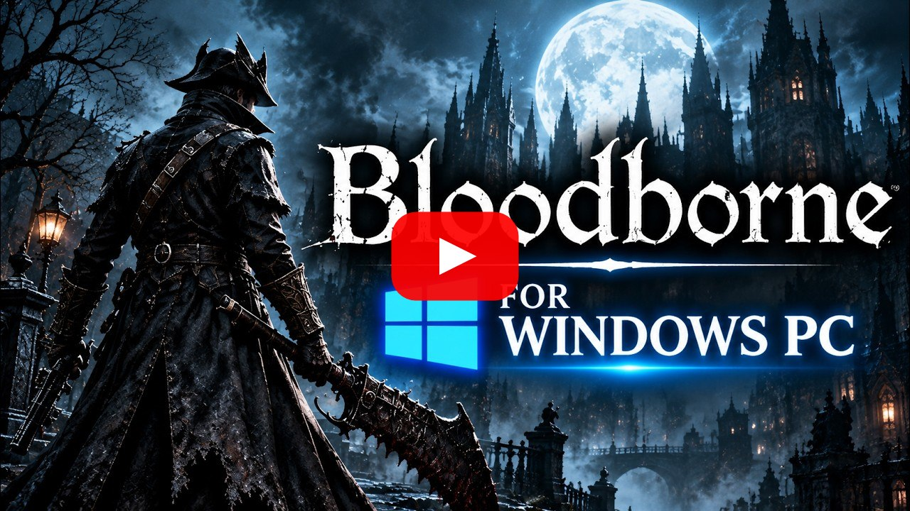
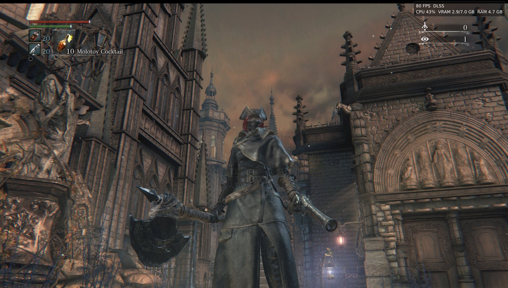
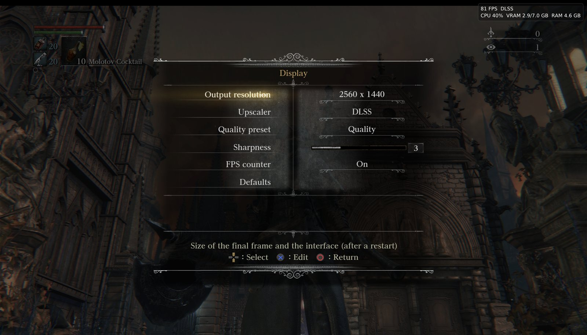
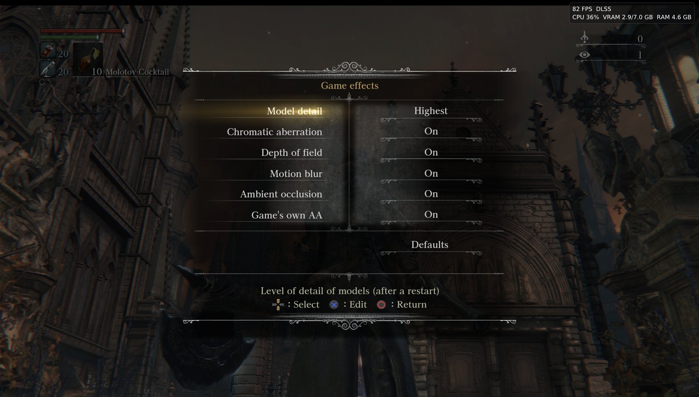
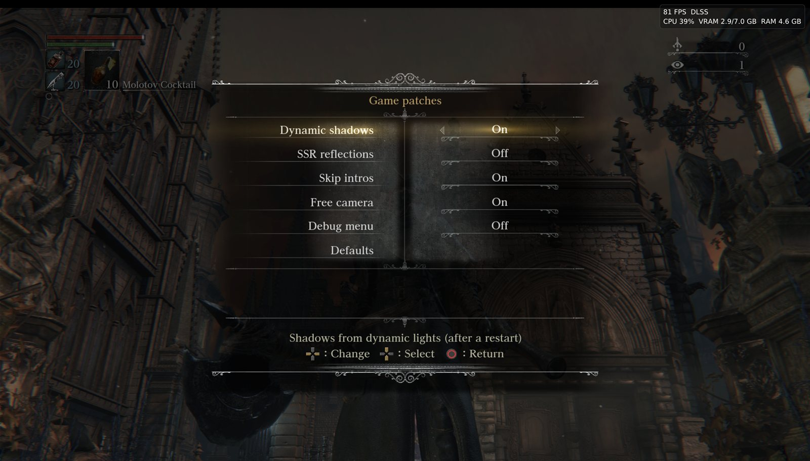
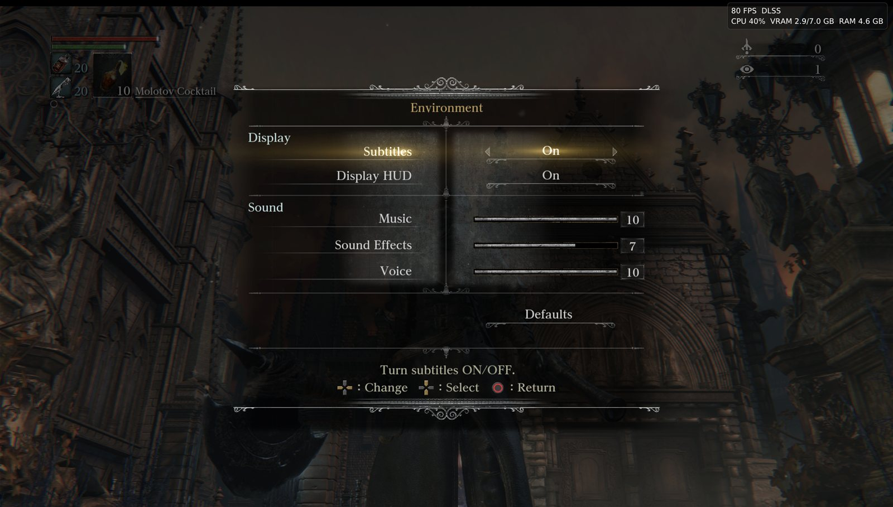
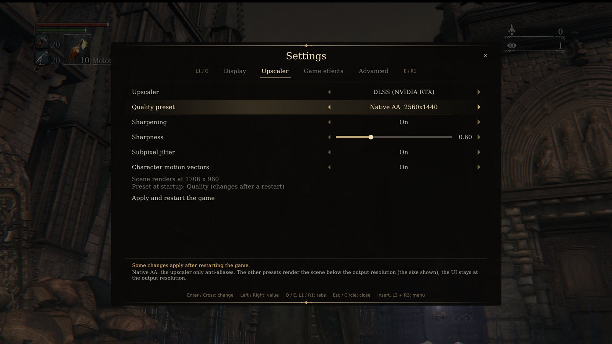
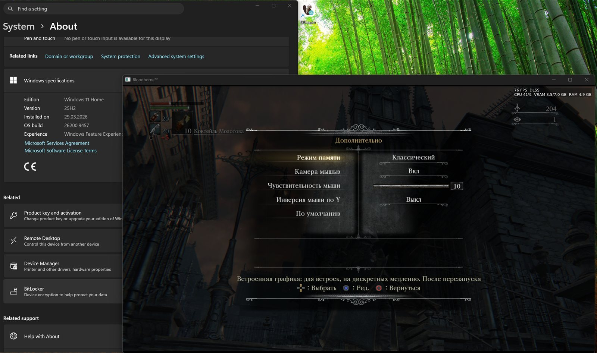

**English** | [Русский](README.ru.md)

# Bloodborne Windows Native

### 🖱️ Mouse and keyboard · 💾 Save anywhere · DLSS · FSR 4 · up to 4K

- **Mouse and keyboard:** the mouse turns the camera directly, as in PC games; every key can be
  rebound.
- **Save copies:** save your progress at any moment (pause menu → **Saves**, or **F5**) and load
  any copy back (**F8**) without restarting the game.
- **DLSS, FSR 4, FSR 3.1**, output up to 4K, unlocked frame rate.

**[Download v1.02](https://github.com/RandomAlien0x33/bloodborne-win-native/releases/download/v1.02/bloodborne-win-native-v1.02.zip)** (Windows 10/11, 116 MB)

[](https://www.youtube.com/watch?v=JUkWqngg8r4)

**[▶ Watch on YouTube](https://www.youtube.com/watch?v=JUkWqngg8r4)**

A native Windows port of *Bloodborne* (PlayStation 4, version 1.09), based on
**[bbport](https://github.com/deadinside28/bloodborne_pc)** by deadinside28.

The game's original executable runs on the PC, a
runtime written for this game takes the place of the PS4 system libraries, and the graphics are
translated to Vulkan.

> **No game files are included.** You need your own dump of Bloodborne CUSA03173, version
> 1.09. Bloodborne is a trademark of Sony Interactive
> Entertainment; this project is not affiliated with Sony or FromSoftware.















## Features

- **Upscaling:** NVIDIA DLSS (RTX cards), AMD FSR 3.1 and FSR 4, TAA; output up to 4K.
- **Frame rate:** unlocked, 60 or 90 FPS (community patches).
- **Settings in the game's own System menu** (Display, Game effects, Additional) and in the
  port's menu (**Insert** or L3+R3).
- **Mouse and keyboard:** the mouse turns the camera directly, as in PC games.
- **Memory modes:** Classic (most tested) and Hybrid (faster on graphics cards).
- **Save copies** from the pause menu and with F5 / F8 (see [Saves](#saves)).
- Safe saves, mods without changing the game files, game effects on and off.

## Requirements

- Windows 10 (1803 or newer) or 11, 64-bit.
- A graphics card with Vulkan 1.3. DLSS: NVIDIA RTX 20 series or newer.
- Bloodborne CUSA03173 with the 1.09 update, decrypted (the folder with `eboot.bin`, `sce_module`, `sce_sys`, `dvdroot_ps4`).

## Getting started

1. [Download v1.02](https://github.com/RandomAlien0x33/bloodborne-win-native/releases/download/v1.02/bloodborne-win-native-v1.02.zip) and unpack it.
2. In `bbport.ini` set the game folder:
   ```ini
   game_dir=D:\Games\CUSA03173
   save_dir=
   ```
   `save_dir` is optional: the folder for saves. Empty: `user` next to the port.
   Or leave `game_dir` empty and put the `CUSA03173` folder next to `Bloodborne.cmd`.
3. Start `Bloodborne.cmd`.

DLSS needs NVIDIA's `nvngx_dlss.dll` next to `out\bb-probe.exe`: `bash tools/fetch_dlss.sh`
downloads it from NVIDIA's DLSS SDK (it is not part of this repository).

## Controls

| Keyboard / mouse | PS4 |
|---|---|
| WASD | left stick |
| mouse (or arrow keys) | camera |
| left / right / middle mouse button | R1 / R2 / R3 |
| Space / Left Shift / E / Q | Cross / Circle / Square / Triangle |
| 1 / 3 / R / F | L1 / R1 / L2 / R2 |
| Z / C | L3 / R3 |
| I / K / J / L | d-pad |
| Enter / Tab | Options / touchpad |
| F5 / F8 | save a copy / load the newest copy (press twice) |
| F11 | fullscreen |
| Insert | the port's menu |
| click in the window / hold Left Alt | the window holds the cursor / frees it |

Gamepads work through SDL. Any key can be rebound in `bbport.ini`: `key.r1=3,mouse_left`,
`pad.cross=a`.

## Saves

Bloodborne has a single autosave. The port adds copies of your own:

- **Pause menu → Saves** (after System): **Save** copies your progress as it is now; **Load**
  lists the game's autosave and your copies, each with the date and the place.
- **F5** saves a copy, **F8** loads the newest one. The port's menu (**Insert**) has a **Saves**
  tab as well.
- A load needs no restart: the game goes to the title screen and continues from the copy by
  itself, in a few seconds.
- A load row loads on the second press, so a stray press does nothing. A load asked for during a
  loading screen waits until it ends.
- **Undo the last load** brings back the state from before the last load.
- The 15 newest copies are kept, in `user\saves`. Saving a copy never changes the game's own save.
  In `bbport.ini`: `save_copies` (how many), `quicksave_key`, `quickload_key` (e.g. `Ctrl+S`).

## Building from source

**Setup program:** `setup.bat` installs MSYS2 and the packages, gets the sources and builds the
port in one window.

By hand:

1. Install [MSYS2](https://www.msys2.org) to `C:\msys64`, update it (`pacman -Syu` until nothing
   is left) and install the packages:
   ```
   pacman -S --needed git mingw-w64-clang-x86_64-{clang,lld,libc++,cmake,ninja,pkgconf,python,sdl3,boost,fmt,glslang,spirv-cross,spirv-headers,vulkan-headers,vulkan-loader,vulkan-memory-allocator,xxhash,zydis,robin-map,ffmpeg}
   ```
   `vulkan-headers` must be 1.4.350 or newer.
2. `git clone --recursive https://github.com/RandomAlien0x33/bloodborne-win-native`
3. `run.bat --game-dir D:\Games\CUSA03173`: the first start builds `out\bb-probe.exe`
   (`build.sh` in the CLANG64 environment), then starts the game.

## Credits

- **[deadinside28](https://github.com/deadinside28/bloodborne_pc)**: bbport, the native port
  this is built on.
- **[yumlevi](https://github.com/yumlevi/bloodborne_pc)**

## License

GPL-2.0-or-later (see `LICENSE`). Bundled components keep their own licenses (shadPS4's video
core: GPL-2.0-or-later; the DLSS bridge in `gpu/dlss_bridge`: MIT). NVIDIA DLSS and AMD FidelityFX
binaries are not part of this repository.
