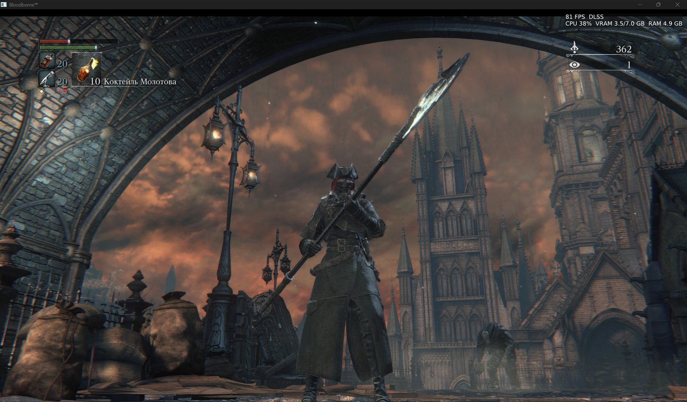
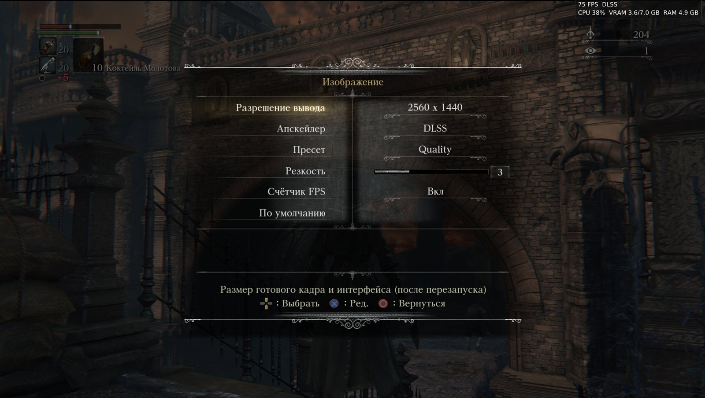
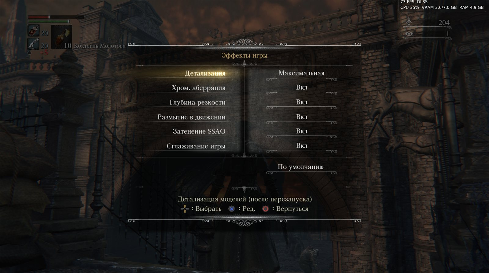
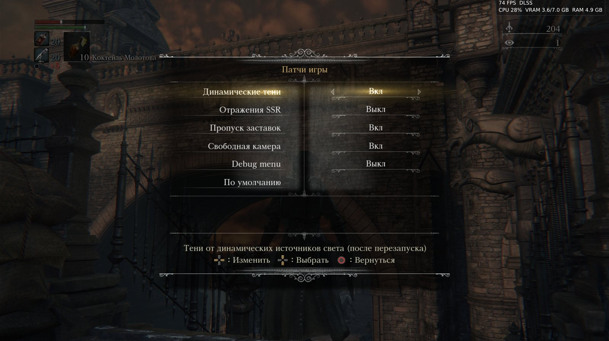
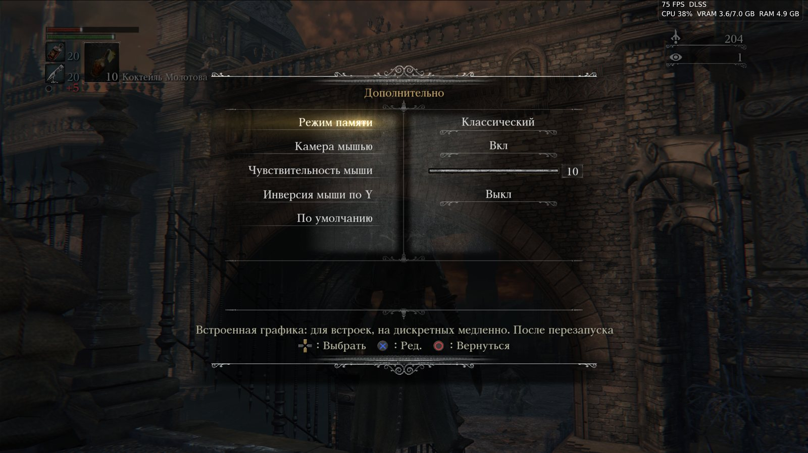
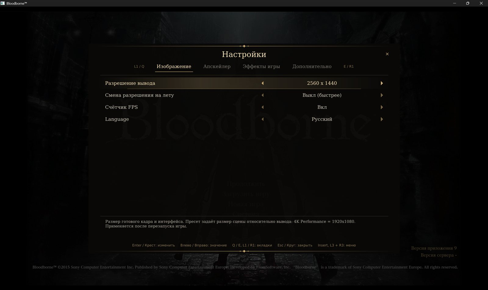

[English](README.md) | **Русский**

# Bloodborne Windows Native

### 🖱️ Мышь и клавиатура · 💾 Сохранение в любой момент · DLSS · FSR 4 · до 4K

- **Мышь и клавиатура:** мышь поворачивает камеру напрямую, как в PC-играх; любую клавишу можно
  переназначить.
- **Копии сохранений:** сохраняйте прогресс в любой момент (меню паузы → **Сохранения** или
  **F5**) и загружайте любую копию (**F8**) без перезапуска игры.
- **DLSS, FSR 4, FSR 3.1**, вывод до 4K, FPS без ограничения.

**[Скачать v1.02](https://github.com/RandomAlien0x33/bloodborne-win-native/releases/download/v1.02/bloodborne-win-native-v1.02.zip)** (Windows 10/11, 116 МБ)

[](https://www.youtube.com/watch?v=JUkWqngg8r4)

**[▶ Смотреть на YouTube](https://www.youtube.com/watch?v=JUkWqngg8r4)**

Нативный порт *Bloodborne* (PlayStation 4, версия 1.09) для Windows на основе
**[bbport](https://github.com/deadinside28/bloodborne_pc)** от deadinside28.

Оригинальный исполняемый файл игры
запускается прямо на ПК, системные библиотеки PS4 заменяет рантайм, написанный под эту игру, а
графика переводится в Vulkan.

> **Файлов игры здесь нет.** Нужна своя копия Bloodborne CUSA03173 версии 1.09.
> Bloodborne — торговая марка Sony Interactive Entertainment; проект не связан
> с Sony и FromSoftware.














## Возможности

- **Апскейлинг:** NVIDIA DLSS (карты RTX), AMD FSR 3.1 и FSR 4, TAA; вывод до 4K.
- **Частота кадров:** без ограничения, 60 или 90 FPS (патчи сообщества).
- **Настройки в собственном меню игры** System (Изображение, Эффекты игры, Дополнительно) и в
  меню порта (**Insert** или L3+R3).
- **Мышь и клавиатура:** мышь поворачивает камеру напрямую, как в PC-играх.
- **Режимы памяти:** Классический (самый проверенный) и Гибрид (быстрее на видеокартах).
- **Копии сохранений** из меню паузы и клавишами F5 / F8 (см. [Сохранения](#сохранения)).
- Защищённые сейвы, моды без изменения файлов игры, включение и выключение эффектов игры.

## Требования

- Windows 10 (1803 и новее) или 11, 64 бита.
- Видеокарта с Vulkan 1.3. DLSS: NVIDIA RTX 20-й серии и новее.
- Bloodborne CUSA03173 с обновлением 1.09, расшифрованная (папка с `eboot.bin`, `sce_module`, `sce_sys`, `dvdroot_ps4`).

## Как запустить

1. [Скачайте v1.02](https://github.com/RandomAlien0x33/bloodborne-win-native/releases/download/v1.02/bloodborne-win-native-v1.02.zip) и распакуйте.
2. Укажите папку игры в `bbport.ini`:
   ```ini
   game_dir=D:\Games\CUSA03173
   save_dir=
   ```
   `save_dir` необязателен: папка для сейвов. Пусто — `user` рядом с портом.
   Или оставьте `game_dir` пустым и положите папку `CUSA03173` рядом с `Bloodborne.cmd`.
3. Запустите `Bloodborne.cmd`.

Для DLSS нужен `nvngx_dlss.dll` от NVIDIA рядом с `out\bb-probe.exe`: `bash tools/fetch_dlss.sh`
скачивает его из DLSS SDK NVIDIA (в этом репозитории его нет).

## Управление

| Клавиатура / мышь | PS4 |
|---|---|
| WASD | левый стик |
| мышь (или стрелки) | камера |
| левая / правая / средняя кнопка мыши | R1 / R2 / R3 |
| Пробел / левый Shift / E / Q | Крест / Круг / Квадрат / Треугольник |
| 1 / 3 / R / F | L1 / R1 / L2 / R2 |
| Z / C | L3 / R3 |
| I / K / J / L | крестовина |
| Enter / Tab | Options / тачпад |
| F5 / F8 | сохранить копию / загрузить последнюю копию (нажать дважды) |
| F11 | полный экран |
| Insert | меню порта |
| клик в окне / удерживать левый Alt | окно захватывает курсор / отпускает его |

Геймпады работают через SDL. Любую клавишу можно переназначить в `bbport.ini`:
`key.r1=3,mouse_left`, `pad.cross=a`.

## Сохранения

В Bloodborne одно автосохранение. Порт добавляет ваши собственные копии:

- **Меню паузы → Сохранения** (после «Система»): **Сохранить** делает копию прогресса в
  нынешнем виде; **Загрузить** показывает автосохранение игры и ваши копии с датой и местом.
- **F5** сохраняет копию, **F8** загружает последнюю. В меню порта (**Insert**) тоже есть вкладка
  **Сохранения**.
- Загрузка не требует перезапуска: игра сама выходит в главное меню и продолжает с копии, за
  несколько секунд.
- Строка загрузки срабатывает со второго нажатия, так что случайное нажатие ничего не сделает.
  Загрузка, выбранная во время экрана загрузки, подождёт его окончания.
- **Отменить последнюю загрузку** возвращает состояние до последней загрузки.
- Хранятся 15 последних копий, в `user\saves`. Сохранение копии не меняет собственное сохранение
  игры. В `bbport.ini`: `save_copies` (сколько хранить), `quicksave_key`, `quickload_key`
  (например, `Ctrl+S`).

## Сборка из исходников

**Установщик:** `setup.bat` в одном окне ставит MSYS2 и пакеты, скачивает исходники и собирает
порт.

Вручную:

1. Установите [MSYS2](https://www.msys2.org) в `C:\msys64`, обновите (`pacman -Syu`, пока есть
   что обновлять) и поставьте пакеты:
   ```
   pacman -S --needed git mingw-w64-clang-x86_64-{clang,lld,libc++,cmake,ninja,pkgconf,python,sdl3,boost,fmt,glslang,spirv-cross,spirv-headers,vulkan-headers,vulkan-loader,vulkan-memory-allocator,xxhash,zydis,robin-map,ffmpeg}
   ```
   `vulkan-headers` нужен версии 1.4.350 или новее.
2. `git clone --recursive https://github.com/RandomAlien0x33/bloodborne-win-native`
3. `run.bat --game-dir D:\Games\CUSA03173`: первый запуск собирает `out\bb-probe.exe`
   (`build.sh` в окружении CLANG64) и запускает игру.

## Благодарности

- **[deadinside28](https://github.com/deadinside28/bloodborne_pc)** — bbport, нативный порт, на
  котором построен этот.
- **[yumlevi](https://github.com/yumlevi/bloodborne_pc)**

## Лицензия

GPL-2.0-or-later (см. `LICENSE`). Встроенные компоненты сохраняют свои лицензии (видеоядро
shadPS4: GPL-2.0-or-later; мост DLSS в `gpu/dlss_bridge`: MIT). Бинарники NVIDIA DLSS и AMD
FidelityFX в репозиторий не входят.
